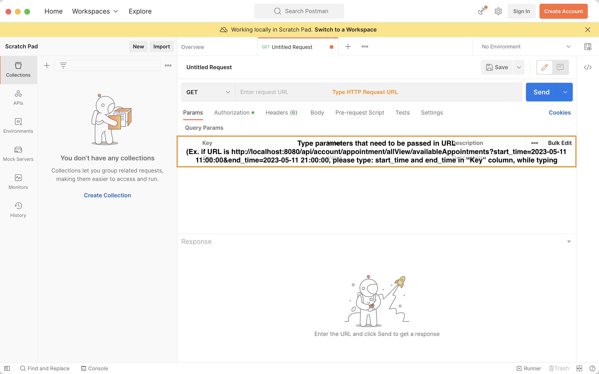

# Clinic-Appointment-System
This is the prototype for showing how Clinic Appointment System performs with the help of Java JDBC and Spring Boot Framework 

## How to Run:

### Option 1
• Download and open **Docker Desktop** in PC/Mac/Linux (link->https://www.docker.com/products/docker-desktop/)
• Run the following commands in terminal:
  ```console
  # clinic-appointment-system -> name of jar file generated
  docker build -t clinic-appointment-system:3.0.5 .
  # container_name can be any name preferred
  docker run -d -p 8080:8080 --name <container_name> clinic-appointment-system:3.0.5
  ```
• If container name already exists in Docker, run the following command before the above commands are executed:
  ```console
  # stop running docker container <container_name>
  docker stop <container_name>
  # remove docker container <container_name>
  docker rm <container_name>
  ```
### Option 2
• Again, Download and open **Docker Desktop** in PC/Mac/Linux (link->https://www.docker.com/products/docker-desktop/) \
• Run the bash file named "execute.sh" \

## Testing
I strongly recommend testing the RESTful APIs using **Postman**, which can be downloaded under https://www.postman.com/downloads/.
Once the app is downloaded, open **Postman** and you should see a whole screen similar as below: \

